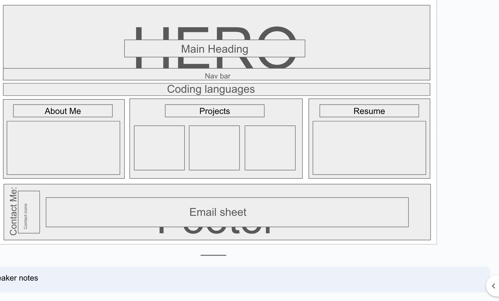
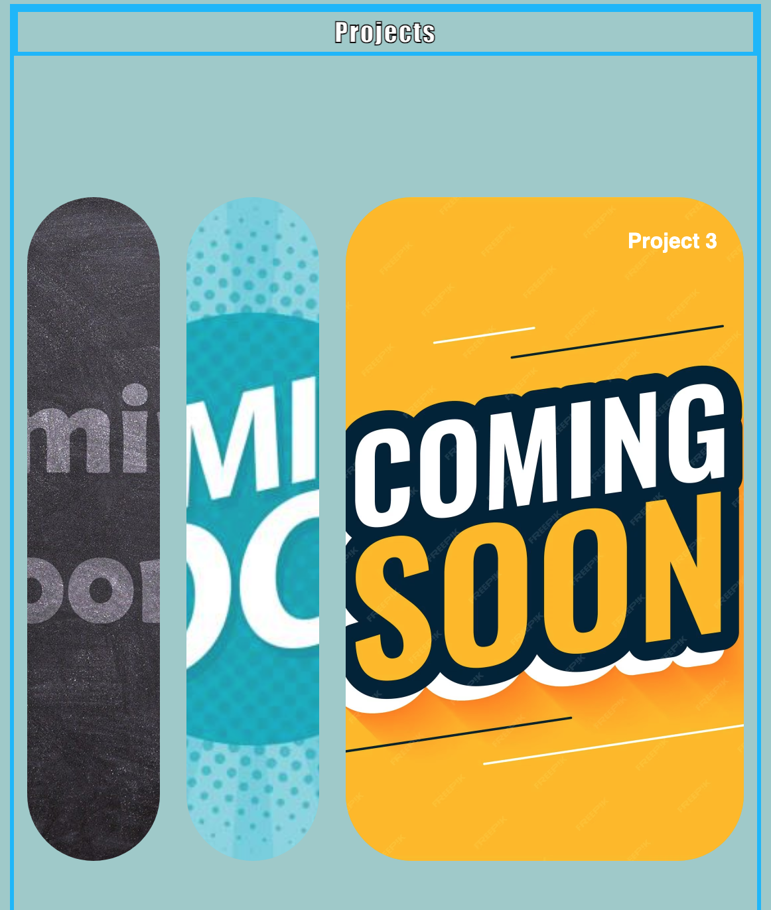

# My-Portfoolio

## Table of Contents: 
* [Installation](#installation)
* [Usage](#usage)
* [Credits](#credits)
* [License](#license)

Installation: 

Step 1: Creating a Repo. 

// to create a repo log into the Github account and select the option to create a repo ensuring that the "add Readme file" box is ticked. 

// Once the repo was created cloning the repo on the terminal using "git clone "<SSH link>"

Step 2: creting the folders and files for the repo:

// to make a folder, in the terminal, use "mkdir (folder name i.e "assests"), in this file the CSS stylesheet will be housed as well as any assests such as images for the page. 

// to make the HTML file and the CSS file use "touch <file name>.html" and the same can be done to make a CSS style sheet but using "touch <file name>.CSS. 

Step 3: Wireframing: 

// All great designs begin as an idea, with this in mind , I spent some time thinking of how i want the page to look and how this would be best achieved, I made the wireframe usign google slides.

Step 3: Creating the code: 

// Since task was to create a portfolio with no previous code, once the idea was complete, I was tasked with completing research to understand how to create the indivdidual pieces of the page, this was done through research on Youtube as well as mdn web docs_

Step 4: Creating a HTML file: 

// I began by adding the skeleton of the page by adding all of the HTML, this meant that once styling had begun, it would be easier to see the changes made and if I like the changes or any alterations were needed.

// in additon to this creating sections within the HTML, helped to visualise each section and understand the get a better understanding where something was not working if an error occurs. It also made it easier to read the code. 

Step 5: Creating the CSS stylesheet: 

// Since there was no intial CSS file to work with, I began by using the CSS file and starting from the header and working through the page, section by section.

Usage: 

    the page will be used as my portfolio, where all of my future projects will live, in additon to this, as the my skills improve and evolve, my portfolio will also evolve to reflect my aquired skills.

Credits: 

    Repo is made by myself, idea for making a project sliding image box came from research on youtube, credit to: Greatstack : youtube video: https://www.youtube.com/watch?v=ly4Dqz2Mz8s&ab_channel=GreatStack
    
    All ammendedments and work completed thereafter was completed independently with a lot of research and a lot more youtube videos as well as referencing lessongs from the bootcamp

License:

    See License in Repo
